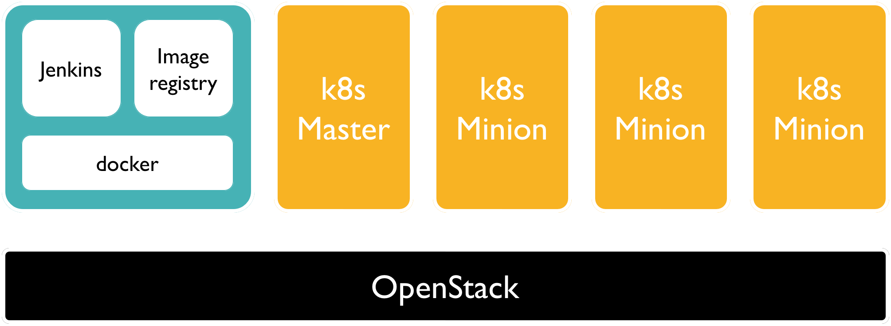
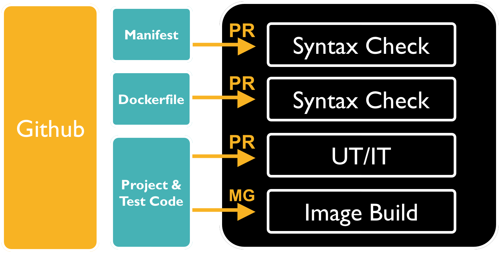

# KubernetesとJenkinsによるCI -チョットDocker-

@ladicle

---

# 目次

1. 環境構築 - JenkinsとKubernetesの構成-
2. 試験 - CIの流れと設定ファイル -
3. 所感 - Pros/Cons -

---

# 1. 環境構築

---

# 現在の環境

---

# 構築方法

各VMのOS: Ubuntu14.04

## Docker
* Jenkins: https://hub.docker.com/_/jenkins/
* ImageRegistry(DockerRegistry): https://docs.docker.com/registry/

## Ansible
* Kubernetes: https://github.com/kubernetes/contrib/pull/802

---

# Jenkinsの構築

## デフォルト機能を使った拡張
* Plugin設定の追加
* タイムゾーンの変更(コンテナ起動時のオプションなので忘れると再生成が必要)
  `JAVA_OPTS='-Duser.timezone=Asia/Tokyo`

---

# 作って捨てるため、Dockerfileに追記が必要なもの
## Docker & Kubernetesの設定
* kubectlの[バイナリ][1]インストール & `$HOME/.kube`に設定ファイル追加
  (Ansibleで構築した場合、設定ファイルは各Nodeの`/etc/kubernetes/kubectl.kubeconfig`にある)
* Dockerコマンドの[バイナリ][2]インストール & RemoteAPIようの鍵(ca.pem, server.pem, server-key.pem)を追加
  (DOCKER_HOST, DOCKER_TLS_VERIFY, DOCKER_CERT_PATHはJenkinsの環境変数に指定しておくと便利)

## Jenkinsのユーザ情報, 全体設定、パスワード鍵情報等
* 一度GUIで設定を入れたら以下のファイルが生成されるので、Dockerfileへ組み込む
  * `$JENKINS_HOME/users/*` : ユーザ情報
  * `$JENKINS_HOME/config.xml` : Jenkinsの全体設定
  * `$JENKINS_HOME/credentials.xml` : 鍵やパスワード報情

## JOB設定
* Jobは[Jenkins Job Builder][3]使ってYAML管理

---

# Kubernetesの構築

## Playbookに+αした部分
* Ansibleでデプロイ対象がSSH鍵認証のみ対応していたので`ansible.cfg`を追加
* `group_vars/all.yaml`にPrivateImageRegistryのアドレス追加

## 構築後の設定
* [SecurityContext][4]でImageRegistryのログイン情報を追加

---

# 2. 試験

---

# 試験の流れ

---

# 文法チェック

チェック対象のファイルを各コマンドが実行可能なコンテナにマウントさせて試験している

* k8sのManifest: Pythonの[yamllint][5]
* Dockerfile: JSのdockerlint

> Manifestの文法チェックでは、実際にcreateさせるかで迷ったが
> 細かい部分は実際に中入って対象のテストを叩かないとわからないので
> 最小限のYAMLのフォーマットチェックに留めた

---

# Unit Test

JenkinsのWorkspaceをマウントしたコンテナ起動 -> 単体テスト実行 -> お片付け

---

# Integration Test

Dockerイメージのビルド -> 前回のお片付け -> コンテナで全コンポーネント起動 -> シナリオテスト実行

---

# Manifestの拡張子

JSONとYAMLのどちらも選択できるが、
混在するのは論外なのでチームにアンケートとったところ満場一致で**YAML**に決定。

> JSON, 読むのは`jq`あるので良いが書くのがつらい
> YAMLの`jq`的な存在[`yq`][6]も存在する。ちょっと便利

---

# [おまけ] Jenkins -KubernetesPlugin-

k8sを操作するPluginは観測する限り[KubernetesPlugin][7]のみ
これはJenkinsのSlaveをKubenetes上にのせるものなので自前Manifestの操作には向かない

> JenkinsJobBuilderも未対応

---

# 3. 所感

---

## Pros
* 1ファイルにまとめられるので簡単にcreate/deleteできる
 * kubectlコマンドの引数がシンプルで、試験用のスクリプトを後から見やすい
 * パラメータの受け渡しも必要なく、ファイル指定のdeleteコマンドだけで試験の後片付けできるのがよい
* Slackコミュニティーが活発&寛容で、`#kubernetes-user`に質問投げると誰かしら答えてくれる

## Cons
- 覚えることおおい

## その他
* Kubernetesのレポジトリ、いろんなBotが住んでいて便利
  (特にRVを煽ってくるのがよい)

---

# Thank you!

  [1]: https://storage.googleapis.com/kubernetes-release/release/v1.2.2/bin/linux/amd64/kubectl
  [2]: https://get.docker.com/builds/Linux/i386/docker-$%7BDOCKER_VERSION%7D
  [3]: http://docs.openstack.org/infra/jenkins-job-builder/
  [4]: http://kubernetes.io/docs/user-guide/security-context/
  [5]: https://pypi.python.org/pypi/yamllint/0.5.1
  [6]: https://github.com/abesto/yq
  [7]: https://wiki.jenkins-ci.org/display/JENKINS/Kubernetes+Plugin
